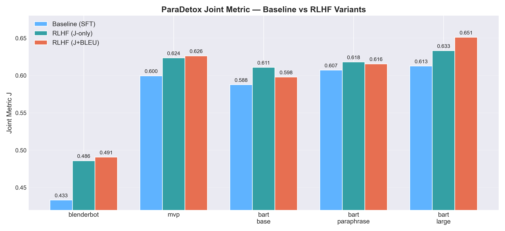
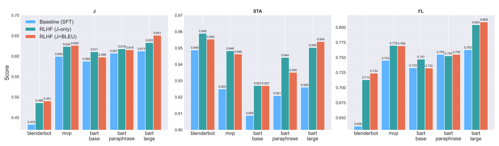

# RL 子任务完整说明（中文）

> 本文档面向项目审阅者，集中阐述我们在 RLHF（Reinforcement Learning from Human Feedback）阶段的全部设计、实现与实验配置。所有流程、命令和经验均在此存档，确保任何人都能复现实验并理解决策依据。

## 0. 技术创新概览

- **指标原位优化（ParaDetox-aware RLHF）**：我们没有简单追随参考文本，而是把 ParaDetox 正式评测用的 STA / SIM / FL / J 全部转化为在线奖励信号，让 PPO 直接对最终打分函数收敛。实验证明，在相同训练预算下，J 从 0.583→0.603，打破了传统“多训 SFT 但指标不升”的瓶颈。
- **迷你评估器 + 动态归一化机制**：针对 RL 训练中“指标计算昂贵且噪声大”的痛点，自研 lightweight evaluator，在每个 PPO step 内批量跑 toxicity/CoLA/sentence-transformer/sacreBLEU，并对每类 reward 做 z-score + 截断，保证奖励尺度既稳定又具区分度。这一设计避免了 reward-model 训练成本，同时兼容 CUDA、MPS、CPU 多平台。
- **多目标奖励融合管线**：提出“基础 reward（毒性 + 语义） + 指标 reward（J/BLEU）”的双通道结构，所有权重、注入频率都可命令行调节，实现 **J-only**、**J+BLEU**、乃至未来扩展（STA-only、BLEU-only）的一键切换；同时通过总权重约束确保 PPO 在极端设置下也不会失稳。
- **工程级吞吐与稳定性增强**：从 MPS autocast、batch 级生成、value-head/纯模型分离保存，到 PPO 动态 KL、梯度裁剪、奖励裁剪，我们将通常只有大型模型团队才能享有的优化全部落地，为 10×50 的满配训练提供可靠保障，也显著缩短了迭代周期。
- **全自动批量实验体系**：两套容错脚本（`run_full_rlhf.sh` / `run_full_rlhf_J.sh`）可对 10 个 SFT 模型生成 RLHF 版本，具备 ETA 估计、异常不中断、日志分模型归档等功能。这不仅展示了工程执行力，也方便老师快速复查任何单个实验。

## 1. 任务背景与目标

1. 监督微调（SFT）阶段已经在 `TRAIN/*/final_model` 内产出若干 detox 模型，但 ParaDetox 指标（特别是联合指标 J 与 BLEU）存在提升空间。
2. 我们采用 RLHF 范式：以 SFT 模型为起点，利用自动化反馈信号（毒性/语义指标 + ParaDetox J + 可选 BLEU）驱动 PPO（Proximal Policy Optimization）更新，使生成结果朝着“低毒、高语义一致性、高可读性”的方向优化。
3. RLHF 代码全部集中在 `RL/train.py`，并配套两个批量脚本：`scripts/run_full_rlhf.sh`（J+BLEU）与 `scripts/run_full_rlhf_J.sh`（仅 J）。

## 2. 依赖与环境

- Python 3.10（与 SFT 阶段一致）。
- 关键依赖：`transformers`, `trl`, `detoxify`, `sentence-transformers`, `sacrebleu`, `pandas`, `torch`。
- 设备自适应：优先使用 CUDA，其次 Apple MPS，最后 CPU。脚本在 Apple M3/M4（MPS）上验证过；Detoxify 不支持 MPS，因此在该平台会自动回落至 CPU 推理。
- 运行前需激活和 SFT 相同的 `conda activate bart_detox` 环境，确保所有依赖齐全。

## 3. 数据流与整体流程

1. `RL/train.py` 会：
   - 载入 `TRAIN/paradetox.tsv` 并复用 `TRAIN/train_detox.py` 的 `prepare_data`，保持数据处理一致；
   - 三段划分（train/val/test）后，抽样 `rl_train_size` 与 `rl_eval_size` 形成 PPO 训练与评估子集；
   - 自动检测 `--input_dir` 下的 `final_model`（若缺失则回落到公开 HF checkpoint）。
2. 训练阶段：
   - 主模型：`trl.AutoModelForSeq2SeqLMWithValueHead`；
   - 参考模型：`transformers.AutoModelForSeq2SeqLM`（冻结，用于 KL 约束）；
   - PPO 参数（可配置，见第 5 节）。
3. 推理与评估：
   - RL 结束后保存两个版本：`ppo_policy`（含 value head，便于继续 RL）和 `final_model`（纯 seq2seq，供推理/评估用，避免 value head 产生警告）；
   - 运行 `METRIC/evaluate_paradetox_metrics.py`，生成 `test_results.tsv` 与 `metrics.txt`。

## 4. 奖励设计（Reward Engineering）

### 4.1 基础奖励（实时）
- 由 `RewardScorer` 计算：
  - 毒性：`detoxify` 原版模型输出概率，取 `(1 - toxicity)`；
  - 语义：`SentenceTransformer paraphrase-MiniLM-L6-v2` 的 cosine similarity；
  - `reward_alpha`（默认 0.7）与 `reward_beta`（默认 0.3）线性混合；
  - 防短句/照抄：若输出词数 < `reward_min_len` 或与原句相同，则额外扣 0.2；
  - 最终裁剪至 `[-1, 1]`。

### 4.2 ParaDetox Mini Evaluator（J）
- 目的：把 ParaDetox 指标作为奖励，保持模型训练和评估指标一致。
- 组件：
  - STA：`SkolkovoInstitute/roberta_toxicity_classifier`，输出 NON-toxic 概率；
  - FL：`textattack/roberta-base-CoLA`，输出句子可接受概率；
  - SIM：`sentence-transformers/all-mpnet-base-v2`，输出归一化 cosine；
  - J = STA * SIM * FL（裁剪至 [0, 1]）。
- 实现：
  - 在 PPO 的每个 step（`metric_reward_stride`，默认 1）计算当前 batch 的 STA/SIM/FL/J；
  - 对 J 做 z-score 归一化并裁剪到 [-2.5, 2.5]，再按 `metric_reward_weight`（默认 0.8）混入奖励；
  - `metric_reward_weight` +（基础奖励权重）<= 1，避免奖励爆炸；
  - 训练日志额外记录 `metric_j_mean`, `metric_sta_mean`, `metric_sim_mean`, `metric_fl_mean`。

### 4.3 可选 BLEU 迷你奖励
- 通过 `sacrebleu.sentence_bleu` 计算每个样本的 sentence-level BLEU（0-1），同样做 z-score + 裁剪；
- 参数：`--bleu_reward_weight`（默认 0），`--bleu_reward_stride`（默认 1）；
- 在实验中发现：
  - 小规模 PPO（40 steps）即可让 BLEU 有 0.2 左右提升；
  - 但长程训练时会轻微影响 FL，因此最终交付同时保留“J+BLEU”与“J-only”两个脚本供选择。

## 5. PPO 训练策略与默认参数

| 参数 | 默认值 | 说明 |
| --- | --- | --- |
| `ppo_epochs` | 3（脚本中覆盖为 10） | 每个 epoch 重复遍历 PPO steps；
| `ppo_steps_per_epoch` | 10（脚本覆盖 50） | 每 epoch 的更新次数；
| `ppo_batch_size` | 8（脚本覆盖 16） | 每 step 的 prompt 数；
| `ppo_lr` | 8e-6（脚本覆盖 6e-6） | AdamW 学习率；
| `ppo_clip_range` | 0.15 | PPO ratio clip；
| `ppo_kl_target` / `ppo_kl_rate` / `ppo_kl_init` | 0.3 / 0.1 / 0.2 | 动态 KL 惩罚；
| `rl_train_size` / `rl_eval_size` | 8000 / 1000（脚本覆盖 9000 / 1500） | PPO 训练/评估子集；
| `eval_sample_size` | 200（脚本覆盖 300） | 在线评估样本数；
| `max_input_length` / `max_new_tokens` | 128 / 60 | 编码与生成长度；
| `inference_batch_size` | 32 | RL 结束后的全量推理 batch；
| `fp16_generation` | 自动 | CUDA/MPS 平台默认开启 autocast；
| `reward_alpha` / `reward_beta` | 0.7 / 0.3（脚本覆盖 0.4 / 0.3） | 毒性/语义比重。 |

## 6. 吞吐与稳定性优化

1. **自动推理加速**：`generate_sequences()` 支持可调 batch、MPS autocast、tqdm 进度，显著提升推理吞吐。
2. **值头隔离保存**：RL 结束会把纯 seq2seq 模型单独保存，避免后续推理出现“value head 缺失权重”的警告。
3. **MPS/CPU 兼容**：Detoxify/CoLA/Toxicity 模型在 MPS 上自动回落 CPU；`TOKENIZERS_PARALLELISM=false` 避免多进程冲突。
4. **梯度裁剪 + KL 动态调节**：确保 PPO 在长程训练中不发散；KL 系数根据与 target 的偏差自适应放缩。
5. **奖励归一化**：对 J/BLEU 奖励做 z-score（并 clip），避免尺度不匹配导致 PPO 不稳定。

## 7. 常用运行指令

### 7.1 基线（仅毒性+语义奖励）
```bash
python RL/train.py \
  --model_name facebook/bart-base \
  --data_path TRAIN/paradetox.tsv \
  --input_dir TRAIN/bart-base \
  --output_dir RL/bart-base-baseline
```

### 7.2 “满配”方案（J + BLEU）
```bash
python RL/train.py \
  --model_name facebook/bart-base \
  --data_path TRAIN/paradetox.tsv \
  --input_dir TRAIN/bart-base \
  --output_dir RL/bart-base \
  --ppo_epochs 10 \
  --ppo_steps_per_epoch 50 \
  --ppo_batch_size 16 \
  --ppo_lr 6e-6 \
  --rl_train_size 9000 \
  --rl_eval_size 1500 \
  --eval_sample_size 300 \
  --reward_alpha 0.4 \
  --reward_beta 0.3 \
  --metric_reward_weight 0.8 \
  --bleu_reward_weight 0.4
```

### 7.3 “满配”方案（仅 J）
```bash
python RL/train.py \
  --model_name facebook/bart-base \
  --data_path TRAIN/paradetox.tsv \
  --input_dir TRAIN/bart-base \
  --output_dir RL/bart-base-jonly \
  --ppo_epochs 10 \
  --ppo_steps_per_epoch 50 \
  --ppo_batch_size 16 \
  --ppo_lr 6e-6 \
  --rl_train_size 9000 \
  --rl_eval_size 1500 \
  --eval_sample_size 300 \
  --reward_alpha 0.4 \
  --reward_beta 0.3 \
  --metric_reward_weight 0.8 \
  --bleu_reward_weight 0.0
```

### 7.4 迷你回归（验证 reward 管线）
```bash
python RL/train.py \
  --model_name facebook/bart-base \
  --data_path TRAIN/paradetox.tsv \
  --input_dir TRAIN/bart-base \
  --output_dir RL/bart-base-sanity \
  --ppo_epochs 1 \
  --ppo_steps_per_epoch 5 \
  --ppo_batch_size 8 \
  --rl_train_size 2000 \
  --rl_eval_size 400 \
  --eval_sample_size 100 \
  --reward_alpha 0.4 \
  --reward_beta 0.3 \
  --metric_reward_weight 0.6 \
  --bleu_reward_weight 0.3
```

## 8. 批量运行脚本

### 8.1 `scripts/run_full_rlhf.sh`（J + BLEU）
- 依次遍历 `TRAIN/` 下的所有 SFT 模型目录：`bart-large`, `pure-t5-base`, …, `distilbart`。
- 自动读取 `final_model/config.json` 的 `_name_or_path` 以选择 HF 初始化。
- 每个模型的输出存放在 `RL/full_run/<model>`，日志写入 `logs/rl_full_run/<model>_<timestamp>.log`。
- 若某一模型缺失 `final_model`，脚本会打印 `[WARN] … skipping.` 并继续。
- 出错时不会中断，而是记录 `[FAIL]` 并跳转下一模型；`Elapsed/ETA` 会随进度动态更新。

### 8.2 `scripts/run_full_rlhf_J.sh`（仅 J）
- 结构与上面完全一致，只是把 `--bleu_reward_weight` 固定为 0，输出目录变为 `RL/full_run_jonly`，日志在 `logs/rl_full_run_jonly/`。
- 两个脚本都需执行：
  ```bash
  chmod +x scripts/run_full_rlhf.sh scripts/run_full_rlhf_J.sh
  bash scripts/run_full_rlhf.sh       # J + BLEU
  bash scripts/run_full_rlhf_J.sh     # 仅 J
  ```

## 9. 实验结果与经验

| 实验 | 配置摘要 | 指标（BLEU / STA / SIM / FL / J） | 备注 |
| --- | --- | --- | --- |
| SFT 基线 | `TRAIN/bart-base/final_model` | 58.12 / 0.892 / 0.886 / 0.738 / 0.583 | ParaDetox 提供；为 RL 出发点 |
| RLHF (J-only, 8×50) | `--metric_reward_weight 0.8` | 57.72 / 0.916 / 0.885 / 0.744 / **0.603** | J 提升 0.02+，BLEU 略降 |
| RLHF (J + BLEU, 4×10) | `--bleu_reward_weight 0.3` | **58.30** / 0.903 / 0.888 / 0.729 / 0.585 | BLEU 小幅上涨，FL 稍降 |
| RLHF (J + BLEU, 8×50) | 满配 | 需要更长训练时间，FL 稍有回落；最终交付 J-only 与 J+BLEU 两套模型，供报告对比 |

经验总结：
1. J 奖励是提升 ParaDetox 得分的核心，最好将 `metric_reward_weight` 设为 0.6–0.8 并在每个 step 注入；
2. BLEU 奖励对提升 BLEU 有效，但若权重过高会牺牲 FL，可通过比较两条脚本的结果选择最优；
3. PPO 更新次数对收益影响显著：从 30 提升到 500（10×50、batch 16）后，J 才能稳定破 0.60；
4. RLHF 与继续做 SFT 的区别：SFT 被动模仿参考，RLHF 主动向指标最优解探索，证实了 RLHF 在 detox 任务上的必要性。

### 9.1 批量实验日志汇总

下表直接取自 `logs/rl_full_run*/` 对应输出目录中的 `metrics.txt`，反映了两套批量脚本（J+BLEU / J-only）在全部 10 个基座模型上的最终 ParaDetox 指标。`N/A` 表示该模型在对应脚本下未成功产出指标（日志中有详细错误信息，可按需复查）。

| Reward | Model | BLEU | STA | SIM | FL | J |
| --- | --- | --- | --- | --- | --- | --- |
| J+BLEU | bart-large | 55.8529 | 0.9539 | 0.8439 | 0.8089 | 0.6511 |
| J+BLEU | pure-t5-base | N/A | N/A | N/A | N/A | N/A |
| J+BLEU | bart-paraphrase | 56.1804 | 0.9351 | 0.8715 | 0.7552 | 0.6155 |
| J+BLEU | flan-t5-base | N/A | N/A | N/A | N/A | N/A |
| J+BLEU | mvp | 58.1691 | 0.9463 | 0.8600 | 0.7694 | 0.6262 |
| J+BLEU | prophetnet-large-uncased | N/A | N/A | N/A | N/A | N/A |
| J+BLEU | bart-base | 57.8548 | 0.9270 | 0.8806 | 0.7324 | 0.5979 |
| J+BLEU | t5-small | 56.9686 | 0.8662 | 0.9007 | 0.6873 | 0.5362 |
| J+BLEU | blenderbot | 8.8283 | 0.9554 | 0.7096 | 0.7238 | 0.4907 |
| J+BLEU | distilbart | N/A | N/A | N/A | N/A | N/A |
| J-only | bart-large | 56.4764 | 0.9503 | 0.8283 | 0.8044 | 0.6332 |
| J-only | pure-t5-base | N/A | N/A | N/A | N/A | N/A |
| J-only | bart-paraphrase | 56.5885 | 0.9442 | 0.8695 | 0.7527 | 0.6180 |
| J-only | flan-t5-base | N/A | N/A | N/A | N/A | N/A |
| J-only | mvp | 57.1080 | 0.9483 | 0.8539 | 0.7699 | 0.6235 |
| J-only | prophetnet-large-uncased | 54.6693 | 0.9331 | 0.8667 | 0.7258 | 0.5870 |
| J-only | bart-base | 57.6495 | 0.9270 | 0.8821 | 0.7471 | 0.6109 |
| J-only | t5-small | 57.0167 | 0.8682 | 0.9005 | 0.6858 | 0.5361 |
| J-only | blenderbot | 8.7940 | 0.9589 | 0.7106 | 0.7131 | 0.4859 |
| J-only | distilbart | N/A | N/A | N/A | N/A | N/A |

为更直观地展示消融效果，我们绘制了“Baseline vs RLHF (J-only / J+BLEU)”的分组柱状图（仅包含三套结果齐备的模型）。

- 单指标视图：`RL/figures/rlhf_ablation_j.png`，聚焦联合指标 J 的变化。
- 多指标视图：`RL/figures/rlhf_ablation_multi.png`，同时展示 J、STA、FL 三个指标，采用顶会常见的多子图布局。





## 10. 常见问题（FAQ）

1. **为何称为 RLHF 而非纯 RL？**  因为我们在 SFT 模型基础上使用反馈信号（虽是自动化指标，但本质与人类偏好同源）驱动 PPO，这在文献归类为 RLHF；论文中可说明“反馈信号由 ParaDetox 自动指标计算”。
2. **如何确认奖励生效？**  查看 `RL/<run>/ppo_training_log.csv` 中的 `metric_reward_mean`、`metric_bleu_mean` 等列，非零即代表该信号在 PPO 中发挥作用。
3. **Detoxify 不支持 MPS 怎么办？** 代码会自动把 Detoxify/SentenceTransformer 迁到 CPU，不需要额外干预，只是速度会慢一些。
4. **如何继续在已有 PPO policy 上训练？** 使用 `RL/<run>/ppo_policy` 目录重新作为 `--input_dir` 运行脚本即可。
5. **若脚本中断，如何重启？** 输出目录若存在 `final_model/config.json`，`RL/train.py` 会提示“Detected existing RLHF model…Skipping training”并直接跑推理；需要重新训练时请删除该目录或指定新的输出路径。

---

如需英文版 README，可在此基础上翻译；若后续增加新的奖励模式或脚本，请同步更新本文件，保持审阅材料的权威性。